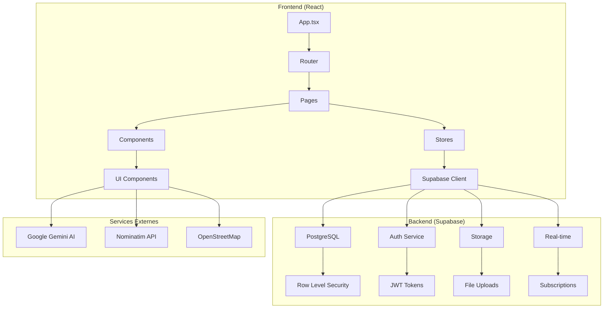
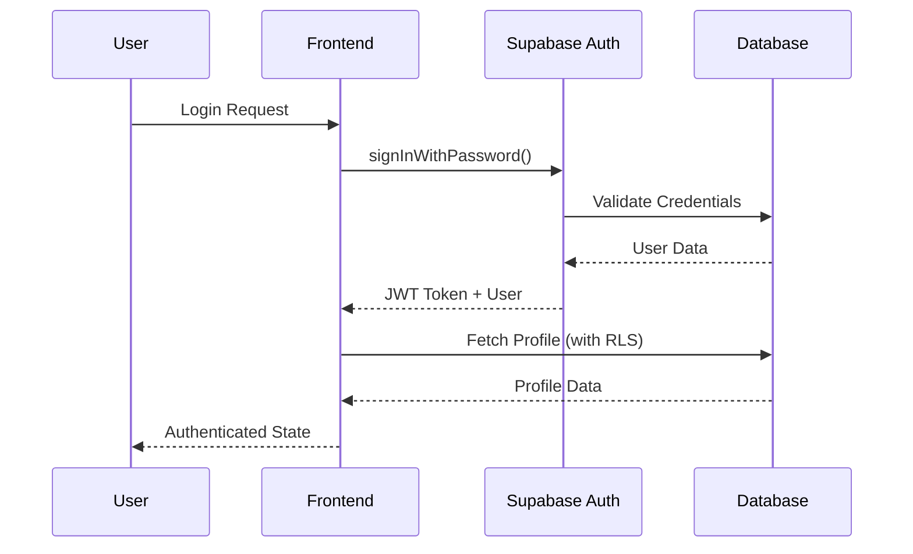
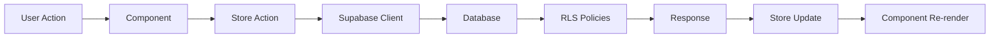

# Architecture d'AlertDisparu

## Vue d'ensemble

AlertDisparu suit une architecture moderne de type **SPA (Single Page Application)** avec une séparation claire entre le frontend React et le backend Supabase. L'application utilise des patterns architecturaux robustes pour assurer la scalabilité, la maintenabilité et la sécurité.

## 🏗️ Architecture générale



## 🎯 Patterns architecturaux

### 1. Architecture en couches

```
┌─────────────────────────────────────┐
│           Presentation Layer        │
│  (React Components, Pages, UI)     │
├─────────────────────────────────────┤
│           Business Logic            │
│     (Stores, Hooks, Services)       │
├─────────────────────────────────────┤
│           Data Access Layer         │
│        (Supabase Client)            │
├─────────────────────────────────────┤
│           External Services         │
│    (Gemini AI, Geocoding APIs)      │
└─────────────────────────────────────┘
```

### 2. Gestion d'état avec Zustand

L'application utilise **Zustand** pour une gestion d'état simple et performante :

```typescript
// Store d'authentification
interface AuthState {
  user: User | null;
  isAuthenticated: boolean;
  token: string | null;
  loading: boolean;
  // Actions
  login: (email: string, password: string) => Promise<Result>;
  register: (userData: UserData) => Promise<Result>;
  logout: () => Promise<void>;
}

// Store des signalements
interface MissingPersonsState {
  reports: MissingPerson[];
  filteredReports: MissingPerson[];
  searchFilters: SearchFilters;
  // Actions CRUD
  loadReports: () => Promise<void>;
  addReport: (report: ReportData) => Promise<Result>;
  updateReport: (id: string, updates: Partial<Report>) => Promise<Result>;
  deleteReport: (id: string) => Promise<Result>;
}
```

### 3. Pattern Repository

Les stores implémentent le pattern Repository pour abstraire l'accès aux données :

```typescript
// Abstraction de l'accès aux données
class MissingPersonsRepository {
  async findAll(): Promise<MissingPerson[]> {
    const { data, error } = await supabase
      .from('missing_persons')
      .select('*')
      .order('created_at', { ascending: false });
    
    if (error) throw error;
    return this.mapToDomain(data);
  }
  
  async create(report: CreateReportData): Promise<MissingPerson> {
    const { data, error } = await supabase
      .from('missing_persons')
      .insert(this.mapToDatabase(report))
      .select()
      .single();
    
    if (error) throw error;
    return this.mapToDomain(data);
  }
}
```

## 🗄️ Architecture de la base de données

### Schéma principal

```sql
-- Table des profils utilisateurs
CREATE TABLE profiles (
    id UUID REFERENCES auth.users(id) PRIMARY KEY,
    email TEXT UNIQUE NOT NULL,
    first_name TEXT NOT NULL,
    last_name TEXT NOT NULL,
    role TEXT NOT NULL CHECK (role IN ('family', 'authority', 'volunteer')),
    profile_picture TEXT,
    created_at TIMESTAMP WITH TIME ZONE DEFAULT NOW(),
    updated_at TIMESTAMP WITH TIME ZONE DEFAULT NOW()
);

-- Table des personnes disparues
CREATE TABLE missing_persons (
    id UUID DEFAULT gen_random_uuid() PRIMARY KEY,
    first_name TEXT NOT NULL,
    last_name TEXT NOT NULL,
    age INTEGER NOT NULL CHECK (age > 0 AND age < 150),
    gender TEXT NOT NULL CHECK (gender IN ('male', 'female', 'other')),
    photo TEXT,
    date_disappeared DATE NOT NULL,
    time_disappeared TIME,
    location_address TEXT NOT NULL,
    location_city TEXT NOT NULL,
    location_state TEXT NOT NULL,
    location_country TEXT NOT NULL DEFAULT 'France',
    location_lat DECIMAL(10, 8),
    location_lng DECIMAL(11, 8),
    description TEXT NOT NULL,
    case_type TEXT CHECK (case_type IN ('disappearance', 'runaway', 'abduction', 'missing_adult', 'missing_child')),
    priority TEXT CHECK (priority IN ('low', 'medium', 'high', 'critical')),
    status TEXT CHECK (status IN ('active', 'found', 'closed')) DEFAULT 'active',
    is_emergency BOOLEAN DEFAULT false,
    circumstances TEXT,
    clothing_description TEXT,
    personal_items TEXT,
    medical_info TEXT,
    behavioral_info TEXT,
    reporter_name TEXT NOT NULL,
    reporter_relationship TEXT NOT NULL,
    reporter_phone TEXT,
    reporter_email TEXT,
    consent_given BOOLEAN NOT NULL DEFAULT false,
    created_at TIMESTAMP WITH TIME ZONE DEFAULT NOW(),
    updated_at TIMESTAMP WITH TIME ZONE DEFAULT NOW(),
    created_by UUID REFERENCES profiles(id) ON DELETE SET NULL
);

-- Table des observations d'investigation
CREATE TABLE investigation_observations (
    id UUID DEFAULT gen_random_uuid() PRIMARY KEY,
    missing_person_id UUID NOT NULL REFERENCES missing_persons(id) ON DELETE CASCADE,
    observer_name TEXT NOT NULL,
    observer_phone TEXT,
    observer_email TEXT,
    observation_date DATE NOT NULL,
    observation_time TIME,
    location_address TEXT NOT NULL,
    location_city TEXT NOT NULL,
    location_state TEXT NOT NULL,
    location_country TEXT NOT NULL DEFAULT 'France',
    location_lat DECIMAL(10, 8),
    location_lng DECIMAL(11, 8),
    description TEXT NOT NULL,
    confidence_level TEXT CHECK (confidence_level IN ('low', 'medium', 'high')) DEFAULT 'medium',
    clothing_description TEXT,
    behavior_description TEXT,
    companions TEXT,
    vehicle_info TEXT,
    witness_contact_consent BOOLEAN NOT NULL DEFAULT false,
    is_verified BOOLEAN NOT NULL DEFAULT false,
    verified_by UUID REFERENCES profiles(id),
    verified_at TIMESTAMP WITH TIME ZONE,
    photos TEXT[],
    photo_descriptions TEXT[],
    created_at TIMESTAMP WITH TIME ZONE DEFAULT NOW(),
    updated_at TIMESTAMP WITH TIME ZONE DEFAULT NOW(),
    created_by UUID REFERENCES profiles(id) ON DELETE SET NULL
);
```

### Relations et contraintes

```mermaid
erDiagram
    profiles ||--o{ missing_persons : creates
    profiles ||--o{ investigation_observations : creates
    profiles ||--o{ investigation_observations : verifies
    missing_persons ||--o{ investigation_observations : has
    
    profiles {
        uuid id PK
        text email UK
        text first_name
        text last_name
        text role
        text profile_picture
        timestamp created_at
        timestamp updated_at
    }
    
    missing_persons {
        uuid id PK
        text first_name
        text last_name
        integer age
        text gender
        text photo
        date date_disappeared
        time time_disappeared
        text location_address
        text location_city
        text location_state
        text location_country
        decimal location_lat
        decimal location_lng
        text description
        text case_type
        text priority
        text status
        boolean is_emergency
        text circumstances
        text clothing_description
        text personal_items
        text medical_info
        text behavioral_info
        text reporter_name
        text reporter_relationship
        text reporter_phone
        text reporter_email
        boolean consent_given
        timestamp created_at
        timestamp updated_at
        uuid created_by FK
    }
    
    investigation_observations {
        uuid id PK
        uuid missing_person_id FK
        text observer_name
        text observer_phone
        text observer_email
        date observation_date
        time observation_time
        text location_address
        text location_city
        text location_state
        text location_country
        decimal location_lat
        decimal location_lng
        text description
        text confidence_level
        text clothing_description
        text behavior_description
        text companions
        text vehicle_info
        boolean witness_contact_consent
        boolean is_verified
        uuid verified_by FK
        timestamp verified_at
        text[] photos
        text[] photo_descriptions
        timestamp created_at
        timestamp updated_at
        uuid created_by FK
    }
```



## 🔐 Sécurité et autorisation

### Row Level Security (RLS)

L'application utilise le système RLS de PostgreSQL pour une sécurité granulaire :

```sql
-- Politiques pour les profils
CREATE POLICY "Les utilisateurs peuvent voir leur propre profil" ON profiles
    FOR SELECT USING (auth.uid() = id);

CREATE POLICY "Les utilisateurs peuvent mettre à jour leur propre profil" ON profiles
    FOR UPDATE USING (auth.uid() = id);

-- Politiques pour les signalements
CREATE POLICY "Tout le monde peut voir les signalements actifs" ON missing_persons
    FOR SELECT USING (status = 'active');

CREATE POLICY "Les utilisateurs authentifiés peuvent créer des signalements" ON missing_persons
    FOR INSERT WITH CHECK (auth.uid() IS NOT NULL);

CREATE POLICY "Les créateurs peuvent modifier leurs signalements" ON missing_persons
    FOR UPDATE USING (auth.uid() = created_by);

-- Politiques pour les observations
CREATE POLICY "Les observations vérifiées sont visibles par tous" ON investigation_observations
    FOR SELECT USING (is_verified = true);

CREATE POLICY "Les autorités peuvent vérifier les observations" ON investigation_observations
    FOR UPDATE USING (
        EXISTS (
            SELECT 1 FROM profiles 
            WHERE profiles.id = auth.uid() 
            AND profiles.role = 'authority'
        )
    );
```

### Flux d'authentification



## 🔄 Flux de données

### Pattern de gestion d'état



### Cycle de vie des données

1. **Initialisation** : Les stores se connectent à Supabase
2. **Authentification** : Vérification du token JWT
3. **Chargement** : Récupération des données avec RLS
4. **Mise à jour** : Actions CRUD avec validation
5. **Synchronisation** : Mise à jour automatique de l'UI

## 🎨 Architecture des composants

### Structure hiérarchique

```
App
├── Router
│   ├── Layout
│   │   ├── Header
│   │   │   ├── UserMenu
│   │   │   └── MobileNavigation
│   │   └── Footer
│   └── Routes
│       ├── HomePage
│       ├── ReportsPage
│       │   ├── SearchFilters
│       │   └── ReportCard[]
│       ├── ReportDetail
│       │   ├── InvestigationObservations
│       │   └── AddObservationForm
│       ├── ReportForm
│       │   ├── ImageAnalysis
│       │   └── GeocodingStatus
│       └── ProfilePage
│           ├── UserStats
│           ├── UserReports
│           └── MyAlerts
```

### Pattern de composition

```typescript
// Composant conteneur
const ReportDetail: React.FC = () => {
  const { report, observations } = useMissingPersonsStore();
  
  return (
    <Layout>
      <ReportHeader report={report} />
      <ReportContent report={report} />
      <InvestigationObservations observations={observations} />
    </Layout>
  );
};

// Composant présentiel
const ReportCard: React.FC<{ report: MissingPerson }> = ({ report }) => {
  return (
    <Card>
      <CardHeader>
        <ReportTitle report={report} />
        <CaseTypeBadge type={report.caseType} />
      </CardHeader>
      <CardContent>
        <ReportDescription report={report} />
        <ReportActions report={report} />
      </CardContent>
    </Card>
  );
};
```

## 🌐 Services externes

### Intégration Google Gemini AI

```typescript
// Service d'analyse d'images
export class ImageAnalysisService {
  async analyzeImage(
    imageFile: File,
    missingPersonName: string,
    description?: string
  ): Promise<ImageAnalysisResult> {
    const model = genAI.getGenerativeModel({ model: 'gemini-1.5-flash' });
    const base64Image = await this.fileToBase64(imageFile);
    
    const result = await model.generateContent([
      this.buildAnalysisPrompt(missingPersonName, description),
      { inlineData: { data: base64Image, mimeType: imageFile.type } }
    ]);
    
    return this.parseGeminiResponse(result.response.text());
  }
}
```

### Service de géocodage

```typescript
// Service de géocodage avec Nominatim
export class GeocodingService {
  async geocodeLocation(
    address: string,
    city: string,
    state: string,
    country: string = 'France'
  ): Promise<GeocodingResult> {
    const queries = this.buildQueryVariants(address, city, state, country);
    
    for (const query of queries) {
      try {
        const result = await this.geocodeFreeQuery(query);
        return result;
      } catch (error) {
        continue; // Essayer la variante suivante
      }
    }
    
    throw new GeocodingError('Aucun résultat trouvé');
  }
}
```

## 📊 Performance et optimisation

### Stratégies d'optimisation

1. **Code Splitting** : Chargement paresseux des composants
2. **Memoization** : Utilisation de `useMemo` et `useCallback`
3. **Virtual Scrolling** : Pour les longues listes
4. **Image Optimization** : Compression et formats modernes
5. **Caching** : Cache intelligent des données Supabase

### Métriques de performance

- **First Contentful Paint** : < 1.5s
- **Largest Contentful Paint** : < 2.5s
- **Cumulative Layout Shift** : < 0.1
- **Time to Interactive** : < 3.5s

## 🔧 Configuration et déploiement

### Variables d'environnement

```typescript
// Configuration par environnement
interface EnvironmentConfig {
  supabase: {
    url: string;
    anonKey: string;
  };
  gemini: {
    apiKey?: string;
  };
  geocoding: {
    provider: 'nominatim';
    rateLimit: number;
  };
}
```

### Build et déploiement

```bash
# Développement
npm run dev

# Build de production
npm run build

# Analyse du bundle
npm run analyze

# Tests
npm run test
npm run test:e2e
```

## 🚀 Évolutivité

### Scalabilité horizontale

- **CDN** pour les assets statiques
- **Load balancing** pour les API
- **Database sharding** si nécessaire
- **Caching Redis** pour les sessions

### Extensibilité

- **Plugin system** pour les nouvelles fonctionnalités
- **Webhook system** pour les intégrations
- **API REST** pour les applications tierces
- **GraphQL** pour les requêtes complexes

---

Cette architecture garantit une application robuste, sécurisée et évolutive, capable de gérer efficacement les cas de disparition tout en maintenant une excellente expérience utilisateur.
