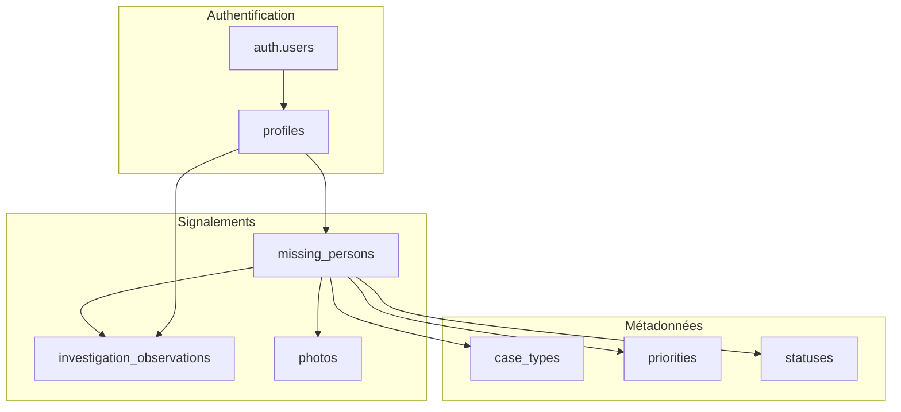

# Schéma de base de données - AlertDisparu

## Vue d'ensemble

AlertDisparu utilise **PostgreSQL** via Supabase avec un schéma optimisé pour la gestion des signalements de disparition, l'authentification des utilisateurs et le système d'investigation collaborative.

## 🗄️ Architecture générale



## 📋 Tables principales

### 1. Table `profiles`

Gère les profils utilisateurs avec leurs rôles et informations personnelles.

```sql
CREATE TABLE profiles (
    id UUID REFERENCES auth.users(id) ON DELETE CASCADE PRIMARY KEY,
    email TEXT UNIQUE NOT NULL,
    first_name TEXT NOT NULL,
    last_name TEXT NOT NULL,
    role TEXT NOT NULL CHECK (role IN ('family', 'authority', 'volunteer')),
    profile_picture TEXT,
    phone TEXT,
    organization TEXT, -- Pour les autorités
    badge_number TEXT, -- Pour les forces de l'ordre
    created_at TIMESTAMP WITH TIME ZONE DEFAULT NOW(),
    updated_at TIMESTAMP WITH TIME ZONE DEFAULT NOW()
);
```

**Champs :**
- `id` : UUID lié à `auth.users`
- `email` : Email unique de l'utilisateur
- `first_name` : Prénom
- `last_name` : Nom de famille
- `role` : Rôle utilisateur (famille, autorité, bénévole)
- `profile_picture` : URL de la photo de profil
- `phone` : Numéro de téléphone (optionnel)
- `organization` : Organisation (pour les autorités)
- `badge_number` : Numéro de badge (pour les forces de l'ordre)

**Contraintes :**
- Clé primaire : `id`
- Clé unique : `email`
- Contrainte de vérification : `role` doit être dans la liste autorisée

### 2. Table `missing_persons`

Stocke les signalements de personnes disparues avec toutes les informations pertinentes.

```sql
CREATE TABLE missing_persons (
    id UUID DEFAULT gen_random_uuid() PRIMARY KEY,
    
    -- Informations sur la personne disparue
    first_name TEXT NOT NULL,
    last_name TEXT NOT NULL,
    age INTEGER NOT NULL CHECK (age > 0 AND age < 150),
    gender TEXT NOT NULL CHECK (gender IN ('male', 'female', 'other')),
    photo TEXT,
    
    -- Informations sur la disparition
    date_disappeared DATE NOT NULL,
    time_disappeared TIME,
    location_address TEXT NOT NULL,
    location_city TEXT NOT NULL,
    location_state TEXT NOT NULL,
    location_country TEXT NOT NULL DEFAULT 'France',
    location_lat DECIMAL(10, 8),
    location_lng DECIMAL(11, 8),
    
    -- Description et contexte
    description TEXT NOT NULL,
    case_type TEXT CHECK (case_type IN ('disappearance', 'runaway', 'abduction', 'missing_adult', 'missing_child')),
    priority TEXT CHECK (priority IN ('low', 'medium', 'high', 'critical')),
    status TEXT CHECK (status IN ('active', 'found', 'closed')) DEFAULT 'active',
    is_emergency BOOLEAN DEFAULT false,
    
    -- Détails supplémentaires
    circumstances TEXT,
    clothing_description TEXT,
    personal_items TEXT,
    medical_info TEXT,
    behavioral_info TEXT,
    last_contact_date DATE,
    
    -- Informations du déclarant
    reporter_name TEXT NOT NULL,
    reporter_relationship TEXT NOT NULL,
    reporter_phone TEXT,
    reporter_email TEXT,
    consent_given BOOLEAN NOT NULL DEFAULT false,
    
    -- Métadonnées
    created_at TIMESTAMP WITH TIME ZONE DEFAULT NOW(),
    updated_at TIMESTAMP WITH TIME ZONE DEFAULT NOW(),
    created_by UUID REFERENCES profiles(id) ON DELETE SET NULL
);
```

**Champs principaux :**

#### Informations personnelles
- `first_name`, `last_name` : Nom complet
- `age` : Âge (0-150 ans)
- `gender` : Genre (male, female, other)
- `photo` : URL de la photo

#### Géolocalisation
- `location_address` : Adresse complète
- `location_city`, `location_state`, `location_country` : Localisation administrative
- `location_lat`, `location_lng` : Coordonnées GPS précises

#### Classification
- `case_type` : Type de cas (disparition, fugue, enlèvement, etc.)
- `priority` : Priorité (faible, moyen, élevé, critique)
- `status` : Statut (actif, trouvé, fermé)
- `is_emergency` : Cas d'urgence

#### Détails contextuels
- `description` : Description générale
- `circumstances` : Circonstances de la disparition
- `clothing_description` : Description des vêtements
- `personal_items` : Objets personnels
- `medical_info` : Informations médicales
- `behavioral_info` : Informations comportementales

### 3. Table `investigation_observations`

Gère les observations d'investigation par les témoins et bénévoles.

```sql
CREATE TABLE investigation_observations (
    id UUID DEFAULT gen_random_uuid() PRIMARY KEY,
    missing_person_id UUID NOT NULL REFERENCES missing_persons(id) ON DELETE CASCADE,
    
    -- Informations sur l'observateur
    observer_name TEXT NOT NULL,
    observer_phone TEXT,
    observer_email TEXT,
    
    -- Détails de l'observation
    observation_date DATE NOT NULL,
    observation_time TIME,
    location_address TEXT NOT NULL,
    location_city TEXT NOT NULL,
    location_state TEXT NOT NULL,
    location_country TEXT NOT NULL DEFAULT 'France',
    location_lat DECIMAL(10, 8),
    location_lng DECIMAL(11, 8),
    
    -- Description de l'observation
    description TEXT NOT NULL,
    confidence_level TEXT NOT NULL CHECK (confidence_level IN ('low', 'medium', 'high')) DEFAULT 'medium',
    
    -- Détails supplémentaires
    clothing_description TEXT,
    behavior_description TEXT,
    companions TEXT, -- Personnes accompagnant la personne disparue
    vehicle_info TEXT, -- Informations sur un véhicule éventuel
    
    -- Consentement et vérification
    witness_contact_consent BOOLEAN NOT NULL DEFAULT false,
    is_verified BOOLEAN NOT NULL DEFAULT false,
    verified_by UUID REFERENCES profiles(id),
    verified_at TIMESTAMP WITH TIME ZONE,
    
    -- Photos et médias
    photos TEXT[], -- URLs des photos jointes
    photo_descriptions TEXT[], -- Descriptions des photos
    
    -- Métadonnées
    created_at TIMESTAMP WITH TIME ZONE DEFAULT NOW(),
    updated_at TIMESTAMP WITH TIME ZONE DEFAULT NOW(),
    created_by UUID REFERENCES profiles(id) ON DELETE SET NULL
);
```

**Champs principaux :**

#### Géolocalisation
- `location_address` : Adresse de l'observation
- `location_lat`, `location_lng` : Coordonnées GPS
- `location_city`, `location_state`, `location_country` : Localisation administrative

#### Qualité de l'observation
- `confidence_level` : Niveau de confiance (faible, moyen, élevé)
- `description` : Description détaillée
- `clothing_description` : Description des vêtements observés
- `behavior_description` : Description du comportement

#### Vérification
- `is_verified` : Observation vérifiée par les autorités
- `verified_by` : Utilisateur qui a vérifié
- `verified_at` : Date/heure de vérification

## 🔗 Relations entre tables

### Diagramme des relations

```mermaid
erDiagram
    profiles ||--o{ missing_persons : creates
    profiles ||--o{ investigation_observations : creates
    profiles ||--o{ investigation_observations : verifies
    missing_persons ||--o{ investigation_observations : has
    
    profiles {
        uuid id PK
        text email UK
        text first_name
        text last_name
        text role
        text profile_picture
        text phone
        text organization
        text badge_number
        timestamp created_at
        timestamp updated_at
    }
    
    missing_persons {
        uuid id PK
        text first_name
        text last_name
        integer age
        text gender
        text photo
        date date_disappeared
        time time_disappeared
        text location_address
        text location_city
        text location_state
        text location_country
        decimal location_lat
        decimal location_lng
        text description
        text case_type
        text priority
        text status
        boolean is_emergency
        text circumstances
        text clothing_description
        text personal_items
        text medical_info
        text behavioral_info
        date last_contact_date
        text reporter_name
        text reporter_relationship
        text reporter_phone
        text reporter_email
        boolean consent_given
        timestamp created_at
        timestamp updated_at
        uuid created_by FK
    }
    
    investigation_observations {
        uuid id PK
        uuid missing_person_id FK
        text observer_name
        text observer_phone
        text observer_email
        date observation_date
        time observation_time
        text location_address
        text location_city
        text location_state
        text location_country
        decimal location_lat
        decimal location_lng
        text description
        text confidence_level
        text clothing_description
        text behavior_description
        text companions
        text vehicle_info
        boolean witness_contact_consent
        boolean is_verified
        uuid verified_by FK
        timestamp verified_at
        text[] photos
        text[] photo_descriptions
        timestamp created_at
        timestamp updated_at
        uuid created_by FK
    }
```



### Relations détaillées

1. **profiles → missing_persons** (1:N)
   - Un utilisateur peut créer plusieurs signalements
   - Relation via `created_by`

2. **profiles → investigation_observations** (1:N)
   - Un utilisateur peut créer plusieurs observations
   - Relation via `created_by`

3. **missing_persons → investigation_observations** (1:N)
   - Un signalement peut avoir plusieurs observations
   - Relation via `missing_person_id`

4. **profiles → investigation_observations** (1:N) - Vérification
   - Un utilisateur autorité peut vérifier plusieurs observations
   - Relation via `verified_by`

## 📊 Index et performances

### Index créés

```sql
-- Index pour les recherches fréquentes
CREATE INDEX idx_missing_persons_status ON missing_persons(status);
CREATE INDEX idx_missing_persons_location ON missing_persons(location_city, location_state);
CREATE INDEX idx_missing_persons_date ON missing_persons(date_disappeared);
CREATE INDEX idx_missing_persons_age ON missing_persons(age);
CREATE INDEX idx_missing_persons_priority ON missing_persons(priority);
CREATE INDEX idx_missing_persons_case_type ON missing_persons(case_type);
CREATE INDEX idx_missing_persons_created_by ON missing_persons(created_by);

-- Index pour les observations
CREATE INDEX idx_investigation_observations_missing_person ON investigation_observations(missing_person_id);
CREATE INDEX idx_investigation_observations_date ON investigation_observations(observation_date);
CREATE INDEX idx_investigation_observations_location ON investigation_observations(location_city, location_state);
CREATE INDEX idx_investigation_observations_verified ON investigation_observations(is_verified);
CREATE INDEX idx_investigation_observations_confidence ON investigation_observations(confidence_level);
CREATE INDEX idx_investigation_observations_created_by ON investigation_observations(created_by);

-- Index géographiques pour les recherches spatiales
CREATE INDEX idx_missing_persons_geo ON missing_persons USING GIST (
    ll_to_earth(location_lat, location_lng)
);
CREATE INDEX idx_observations_geo ON investigation_observations USING GIST (
    ll_to_earth(location_lat, location_lng)
);
```

### Optimisations de requêtes

```sql
-- Recherche géographique efficace
SELECT *, earth_distance(
    ll_to_earth(location_lat, location_lng),
    ll_to_earth(48.8566, 2.3522) -- Paris
) as distance_km
FROM missing_persons
WHERE earth_box(
    ll_to_earth(48.8566, 2.3522),
    10000 -- 10km de rayon
) @> ll_to_earth(location_lat, location_lng)
ORDER BY distance_km;
```

## 🔐 Sécurité et Row Level Security (RLS)

### Politiques RLS activées

```sql
-- Activer RLS sur toutes les tables
ALTER TABLE profiles ENABLE ROW LEVEL SECURITY;
ALTER TABLE missing_persons ENABLE ROW LEVEL SECURITY;
ALTER TABLE investigation_observations ENABLE ROW LEVEL SECURITY;
```

### Politiques pour `profiles`

```sql
-- Les utilisateurs peuvent voir leur propre profil
CREATE POLICY "Les utilisateurs peuvent voir leur propre profil" ON profiles
    FOR SELECT USING (auth.uid() = id);

-- Les utilisateurs peuvent mettre à jour leur propre profil
CREATE POLICY "Les utilisateurs peuvent mettre à jour leur propre profil" ON profiles
    FOR UPDATE USING (auth.uid() = id);

-- Les autorités peuvent voir tous les profils
CREATE POLICY "Les autorités peuvent voir tous les profils" ON profiles
    FOR SELECT USING (
        EXISTS (
            SELECT 1 FROM profiles 
            WHERE profiles.id = auth.uid() 
            AND profiles.role = 'authority'
        )
    );
```

### Politiques pour `missing_persons`

```sql
-- Tout le monde peut voir les signalements actifs
CREATE POLICY "Tout le monde peut voir les signalements actifs" ON missing_persons
    FOR SELECT USING (status = 'active');

-- Les utilisateurs authentifiés peuvent créer des signalements
CREATE POLICY "Les utilisateurs authentifiés peuvent créer des signalements" ON missing_persons
    FOR INSERT WITH CHECK (auth.uid() IS NOT NULL);

-- Les créateurs peuvent modifier leurs signalements
CREATE POLICY "Les créateurs peuvent modifier leurs signalements" ON missing_persons
    FOR UPDATE USING (auth.uid() = created_by);

-- Les créateurs peuvent supprimer leurs signalements
CREATE POLICY "Les créateurs peuvent supprimer leurs signalements" ON missing_persons
    FOR DELETE USING (auth.uid() = created_by);

-- Les autorités peuvent voir tous les signalements
CREATE POLICY "Les autorités peuvent voir tous les signalements" ON missing_persons
    FOR SELECT USING (
        EXISTS (
            SELECT 1 FROM profiles 
            WHERE profiles.id = auth.uid() 
            AND profiles.role = 'authority'
        )
    );
```

### Politiques pour `investigation_observations`

```sql
-- Les observations vérifiées sont visibles par tous
CREATE POLICY "Les observations vérifiées sont visibles par tous" ON investigation_observations
    FOR SELECT USING (is_verified = true);

-- Les créateurs peuvent voir leurs observations
CREATE POLICY "Les créateurs peuvent voir leurs observations" ON investigation_observations
    FOR SELECT USING (auth.uid() = created_by);

-- Les utilisateurs authentifiés peuvent créer des observations
CREATE POLICY "Les utilisateurs authentifiés peuvent créer des observations" ON investigation_observations
    FOR INSERT WITH CHECK (auth.uid() IS NOT NULL);

-- Les créateurs peuvent modifier leurs observations
CREATE POLICY "Les créateurs peuvent modifier leurs observations" ON investigation_observations
    FOR UPDATE USING (auth.uid() = created_by);

-- Les autorités peuvent vérifier les observations
CREATE POLICY "Les autorités peuvent vérifier les observations" ON investigation_observations
    FOR UPDATE USING (
        EXISTS (
            SELECT 1 FROM profiles 
            WHERE profiles.id = auth.uid() 
            AND profiles.role = 'authority'
        )
    );
```

## 🔄 Triggers et fonctions

### Fonction de mise à jour automatique

```sql
-- Fonction pour mettre à jour automatiquement updated_at
CREATE OR REPLACE FUNCTION update_updated_at_column()
RETURNS TRIGGER AS $$
BEGIN
    NEW.updated_at = NOW();
    RETURN NEW;
END;
$$ language 'plpgsql';

-- Triggers pour toutes les tables
CREATE TRIGGER update_profiles_updated_at 
    BEFORE UPDATE ON profiles
    FOR EACH ROW EXECUTE FUNCTION update_updated_at_column();

CREATE TRIGGER update_missing_persons_updated_at 
    BEFORE UPDATE ON missing_persons
    FOR EACH ROW EXECUTE FUNCTION update_updated_at_column();

CREATE TRIGGER update_investigation_observations_updated_at 
    BEFORE UPDATE ON investigation_observations
    FOR EACH ROW EXECUTE FUNCTION update_updated_at_column();
```

### Fonction de création automatique de profil

```sql
-- Fonction pour créer automatiquement un profil lors de l'inscription
CREATE OR REPLACE FUNCTION public.handle_new_user()
RETURNS TRIGGER AS $$
BEGIN
    INSERT INTO public.profiles (id, email, first_name, last_name, role)
    VALUES (
        NEW.id,
        NEW.email,
        COALESCE(NEW.raw_user_meta_data->>'first_name', ''),
        COALESCE(NEW.raw_user_meta_data->>'last_name', ''),
        COALESCE(NEW.raw_user_meta_data->>'role', 'volunteer')
    );
    RETURN NEW;
END;
$$ LANGUAGE plpgsql SECURITY DEFINER;

-- Trigger pour créer automatiquement un profil
CREATE TRIGGER on_auth_user_created
    AFTER INSERT ON auth.users
    FOR EACH ROW EXECUTE FUNCTION public.handle_new_user();
```

### Fonction de calcul de distance

```sql
-- Fonction pour calculer la distance entre deux points géographiques
CREATE OR REPLACE FUNCTION calculate_observation_distance(
    lat1 DECIMAL, lng1 DECIMAL, 
    lat2 DECIMAL, lng2 DECIMAL
) RETURNS DECIMAL AS $$
BEGIN
    -- Formule de Haversine pour calculer la distance en km
    RETURN 6371 * acos(
        cos(radians(lat1)) * cos(radians(lat2)) * 
        cos(radians(lng2) - radians(lng1)) + 
        sin(radians(lat1)) * sin(radians(lat2))
    );
END;
$$ LANGUAGE plpgsql;
```

## 📈 Vues et requêtes complexes

### Vue des statistiques d'observations

```sql
CREATE OR REPLACE VIEW observation_statistics AS
SELECT 
    mp.id as missing_person_id,
    mp.first_name,
    mp.last_name,
    COUNT(io.id) as total_observations,
    COUNT(io.id) FILTER (WHERE io.is_verified = true) as verified_observations,
    COUNT(io.id) FILTER (WHERE io.confidence_level = 'high') as high_confidence_observations,
    MIN(io.observation_date) as first_observation_date,
    MAX(io.observation_date) as last_observation_date,
    COUNT(DISTINCT io.location_city) as cities_with_observations
FROM missing_persons mp
LEFT JOIN investigation_observations io ON mp.id = io.missing_person_id
GROUP BY mp.id, mp.first_name, mp.last_name;
```

### Vue des observations avec distances

```sql
CREATE OR REPLACE VIEW observations_with_distances AS
SELECT 
    io.*,
    mp.location_lat as disappearance_lat,
    mp.location_lng as disappearance_lng,
    calculate_observation_distance(
        io.location_lat, io.location_lng,
        mp.location_lat, mp.location_lng
    ) as distance_from_disappearance_km
FROM investigation_observations io
JOIN missing_persons mp ON io.missing_person_id = mp.id;
```

### Vue des signalements récents

```sql
CREATE OR REPLACE VIEW recent_reports AS
SELECT 
    mp.*,
    p.first_name as creator_first_name,
    p.last_name as creator_last_name,
    p.role as creator_role,
    COUNT(io.id) as observation_count,
    MAX(io.observation_date) as last_observation_date
FROM missing_persons mp
LEFT JOIN profiles p ON mp.created_by = p.id
LEFT JOIN investigation_observations io ON mp.id = io.missing_person_id
WHERE mp.status = 'active'
GROUP BY mp.id, p.id
ORDER BY mp.created_at DESC;
```

## 🗂️ Stockage des fichiers

### Configuration Supabase Storage

```sql
-- Créer le bucket pour les photos
INSERT INTO storage.buckets (id, name, public) 
VALUES ('photos', 'photos', true);

-- Politique pour l'upload de photos
CREATE POLICY "Les utilisateurs authentifiés peuvent uploader des photos" ON storage.objects
    FOR INSERT WITH CHECK (
        bucket_id = 'photos' AND 
        auth.role() = 'authenticated'
    );

-- Politique pour la lecture des photos
CREATE POLICY "Les photos sont publiques" ON storage.objects
    FOR SELECT USING (bucket_id = 'photos');
```

### Structure des fichiers

```
photos/
├── profiles/
│   └── {user_id}/
│       └── avatar.jpg
├── missing_persons/
│   └── {report_id}/
│       ├── photo_1.jpg
│       └── photo_2.jpg
└── observations/
    └── {observation_id}/
        ├── photo_1.jpg
        └── photo_2.jpg
```

## 🔧 Maintenance et monitoring

### Requêtes de monitoring

```sql
-- Statistiques générales
SELECT 
    'Signalements actifs' as metric,
    COUNT(*) as value
FROM missing_persons 
WHERE status = 'active'

UNION ALL

SELECT 
    'Observations vérifiées' as metric,
    COUNT(*) as value
FROM investigation_observations 
WHERE is_verified = true

UNION ALL

SELECT 
    'Utilisateurs actifs' as metric,
    COUNT(*) as value
FROM profiles 
WHERE created_at > NOW() - INTERVAL '30 days';
```

### Nettoyage des données

```sql
-- Supprimer les signalements fermés anciens (plus de 2 ans)
DELETE FROM missing_persons 
WHERE status = 'closed' 
AND updated_at < NOW() - INTERVAL '2 years';

-- Archiver les observations non vérifiées anciennes (plus de 1 an)
UPDATE investigation_observations 
SET is_verified = false 
WHERE is_verified = false 
AND created_at < NOW() - INTERVAL '1 year';
```

---

Ce schéma de base de données est conçu pour être évolutif, sécurisé et performant, tout en respectant les contraintes légales et éthiques liées à la gestion des données de personnes disparues.
